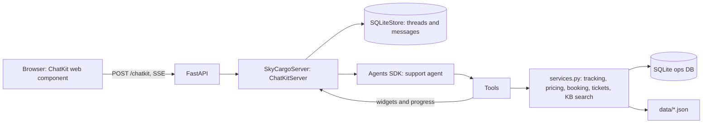

# SkyCargo AI Support Desk

An AI customer support agent for an airport-to-airport air freight company. Customers can track
Air Waybills, get freight quotes, book shipments, understand policies, and raise damage or delay
claims, all in one chat with live cards for shipments, quotes, bookings, and tickets.

Built with a self-hosted **OpenAI ChatKit** server, the **OpenAI Agents SDK**, **FastAPI**, and
**SQLite**.

## What it does

| Customer asks | What happens |
|---|---|
| "Where is 842-12345675?" | Validates the AWB check digit, looks it up, shows a tracking card |
| "Price for 150 kg PNQ to DXB" | Computes chargeable weight (actual vs volumetric), applies the rate card, shows a quote card |
| "Book it" | Restates the details, waits for an explicit yes, then creates a booking with a real-format AWB |
| "My crate arrived broken" | Retrieves the claims policy, explains it, opens a prioritised ticket with an SLA |
| "Can I ship lithium batteries?" | Explains dangerous goods rules and routes to the DG desk instead of booking |

## Architecture



| File | Role |
|---|---|
| `app/main.py` | FastAPI app. `/chatkit` endpoint, per-user request context, serves the page |
| `app/server.py` | `ChatKitServer.respond`: loads history, runs the agent, streams events |
| `app/agent.py` | Agent instructions: grounding rules, booking confirmation, DG and claims handling |
| `app/tools.py` | Six function tools. Stream widgets and progress updates into the chat |
| `app/services.py` | Pure business logic, no LLM. Fully unit tested |
| `app/widgets.py` | Tracking, quote, booking, and ticket cards |
| `app/store.py` | Durable ChatKit `Store` on SQLite with JSON blobs, threads scoped per user |
| `evals/` | Behavioural evals: did the agent call the right tools and say the right things |
| `tests/` | 26 unit tests for pricing, AWB validation, bookings, tickets, retrieval, store isolation |

## Run it

You need Python 3.11+ and an API key from OpenAI, or a free one from Google Gemini (see below).

```bash
python -m venv .venv
# macOS/Linux:  source .venv/bin/activate
# Windows:      .venv\Scripts\activate
pip install -r requirements.txt

cp .env.example .env        # Windows: copy .env.example .env
# put your OPENAI_API_KEY in .env

pytest                      # 26 tests, no API key needed
uvicorn app.main:app --reload
```

Open http://localhost:8000 and tap a shipment on the left board, or type your own question.

### Run it for free with Google Gemini

Gemini offers an OpenAI-compatible endpoint with a free tier (no credit card). Create a key at
https://aistudio.google.com/apikey, then set these in `.env`:

```
OPENAI_API_KEY=your-gemini-key
OPENAI_BASE_URL=https://generativelanguage.googleapis.com/v1beta/openai/
OPENAI_MODEL=gemini-3.6-flash
```

When `OPENAI_BASE_URL` is set, `app/agent.py` points the Agents SDK at that provider, switches to
the Chat Completions API, and turns off OpenAI tracing. The model name must be one listed in Google
AI Studio for your key. The free tier has rate limits, so wait a minute if you see a 429 error.

Run the evals (uses the API, costs a little):

```bash
python -m evals.run_evals
```

## Demo script (2 minutes, good for interviews)

1. Tap **842-23456786** (delayed pharma). Ask "Do I get compensation?" The agent tracks it, pulls the
   delay policy, and explains the 10% credit rule without over-promising.
2. Ask "Quote 150 kg, 4 boxes of 80×60×60 cm, Pune to London." Point out that the volumetric weight
   wins over actual weight, which is how real air freight is priced.
3. Say "Book it for Deccan Exports to Thames Imports, ready tomorrow." Show that it asks for
   confirmation first. Say yes, then track the new AWB it created.
4. Ask "Can I send lithium batteries?" Show it refuses to book and routes to the DG desk.
5. Run `python -m evals.run_evals` and show the pass rate.

## Design decisions worth talking about

- **Business logic is separate from the LLM.** Pricing, validation, and booking rules live in plain
  Python with unit tests. The model decides *what* to do; code decides *how much it costs*. This is
  how you stop an LLM from inventing prices.
- **Tools return errors instead of raising**, so the model can recover and ask the user to fix an
  AWB rather than crashing the turn.
- **Human-in-the-loop for irreversible actions.** Booking requires an explicit confirmation, and an
  eval checks that it never books on the first message.
- **Durable, per-user chat storage** following the ChatKit guidance of JSON blobs, so upgrading the
  library doesn't need migrations.
- **Evals over vibes.** Tool-choice checks catch regressions when you change the prompt or model.

## Next steps to level it up

Each of these is a good commit and a good interview story.

1. **Real RAG.** Replace keyword search in `search_help_articles` with embeddings in pgvector or
   Chroma, add 30+ longer policy documents, and measure retrieval hit rate with the eval set.
2. **Guardrails.** Add an Agents SDK input guardrail that blocks prompt injection and off-topic use
   before the main model runs.
3. **Auth.** Replace the demo `x-user-id` header with real login (JWT), and only show a customer
   their own shipments.
4. **Handoffs.** Split into a triage agent that hands off to a claims agent and a sales agent.
5. **Attachments.** Enable ChatKit uploads so customers can attach damage photos to claims.
6. **Observability.** Add tracing (the Agents SDK has it built in) and log cost and latency per turn.
7. **Deploy.** Add a Dockerfile, deploy to Render, Railway, or a cloud free tier, and register your
   domain in the OpenAI domain allowlist to get a real `domainKey`.
8. **Widget templates.** ChatKit now prefers `.widget` template files over the widget classes used
   here. Migrating is a good small task.

## Switching the domain (real estate version)

The structure stays the same; only data and tools change.

| Air cargo | Real estate support |
|---|---|
| `shipments.json` | `properties.json` and `tenancies.json` |
| `track_shipment` | `get_property` / `get_tenancy` |
| `get_quote` | `estimate_rent` or `compare_listings` |
| `book_shipment` | `book_site_visit` |
| `create_support_ticket` (damage, delay) | `raise_maintenance_request` (plumbing, electrical) |
| Help centre: claims, customs, DG | Help centre: deposits, RERA rules, notice periods |

## Resume bullets (only after you've built and understood it)

- Built an AI customer support agent for an air freight use case using OpenAI ChatKit (self-hosted),
  the Agents SDK, and FastAPI, with 6 function tools for tracking, pricing, booking, and claims.
- Implemented durable per-user conversation storage on SQLite and streamed rich UI cards and progress
  updates into the chat.
- Kept pricing and validation logic out of the LLM with 26 unit tests, and wrote a behavioural eval
  suite checking tool choice and safe behaviour (no booking without confirmation, DG escalation).

Replace these with your own numbers once you have them, such as eval pass rate or retrieval
accuracy after adding embeddings.

All company names, AWBs, rates, and policies in `data/` are fictional.
